<h1 align="center">
  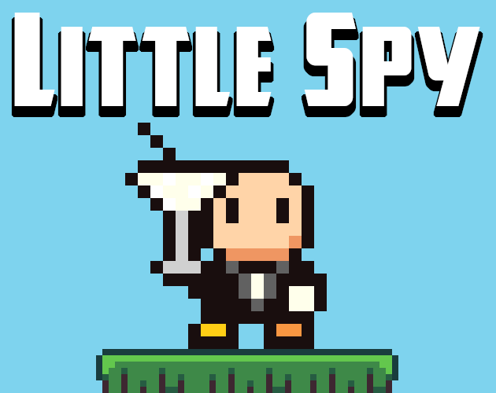
   
  Little Spy
</h1>

## Little Spy

### Plot

**Airdrop into an enemy stronghold, find and recover stolen intelligence and technology. *Fight your way out!***

### Objective

Collect as much stolen intelligence and technology as you can and get to the
extraction point before the helicopter leaves without you. Earn a higher agent
ranking by collecting more items and complete the mission as fast as possible
to earn a higher bonus.

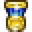&nbsp;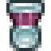&nbsp;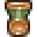&nbsp;

### Game Mechanics

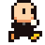 Little Spy can run and jump. **Holding jump extends the jump height**.

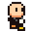 **Little Spy is a climber**. They can grab walls and slide down them, jump climb up
them or wall jump away from them.

 Like all the best spies, **Little Spy has a gadget**; a parachute that can stow and
deploy itself.

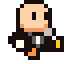 **Little Spy has a killer flying kick**, which can be used to dash, attack enemies
or double jump.

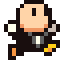 Little Spy can **use all of these skills in combination**.

#### The enemies

Enemies can be stomped or kicked:

  * Guards (no helmet) require 1 hit to kill.
  * Soldiers (helmets) require 2 hits to kill.

Enemies have teleport technology and new recruits will teleport into the game
to replace their fallen comrades.

### Controls

Little Spy should work with most game controllers.

&nbsp;&nbsp;&nbsp;&nbsp;
 
Move

&nbsp;&nbsp;&nbsp;
&nbsp;&nbsp;&nbsp;

 
&nbsp;&nbsp;&nbsp;&nbsp;&nbsp;&nbsp;&nbsp;&nbsp;&nbsp;&nbsp;Jump&nbsp;&nbsp;&nbsp;&nbsp;Kick&nbsp;&nbsp;&nbsp;&nbsp;&nbsp;Parachute

#### WASD & Cursors

&nbsp;&nbsp;&nbsp;&nbsp; 
&nbsp;&nbsp;&nbsp;&nbsp;
 
Move

&nbsp;&nbsp;&nbsp;&nbsp;
 
Jump

&nbsp;&nbsp;&nbsp;&nbsp;
 
Parachute

 
Kick

## My First Game Jam: Summer 2021

Little Spy is my entry in the [My First Game Jam: Summer 2021](https://itch.io/jam/my-first-game-jam-summer-2021).

The theme for the jam was ✨Free✨. My interpretation of the theme is to create
a game using only tools that are free software, free of cost, or game assets
that are free or in the public domain.

I will release the game project and code under an MIT license when the jam concludes.

### Dev Log

I've been wanting to learn Godot for a while now, so decided to use this jam as
motivation. I haven't written a game since the 1980s, but I have a background
in software development. My DevLog from the jam is below:

  * [Little Spy - DevLog](https://itch.io/jam/my-first-game-jam-summer-2021/topic/1497343/little-spy-devlog)

## Tools

I used these excellent tools to make the game.

  * [Godot Engine](https://godotengine.org/)
  * [GIMP](https://www.gimp.org/)
  * [Ocenaudio](https://www.ocenaudio.com/)
  * [Ubuntu MATE](https://ubuntu-mate.org)

## Credits

  * Code & Game Design: [Martin Wimpress](https://twitter.com/m_wimpress)

A big *"Thank you!"* to everyone below who makes their art 🖌
music 🎶 or sounds 🔊 freely available for others to build on. Little Spy would
have been shapes and silence had it not been for these fine people:

  * Sprites
    * Spy: [DezrasDragons](https://opengameart.org/users/dezrasdragons) & [GrafxKid](https://opengameart.org/users/grafxkid)
    * Guard & Soldier [Umz](https://opengameart.org/users/umz) & [GrafxKid](https://opengameart.org/users/grafxkid)
    * Military items: [AngryMeteor.com](https://opengameart.org/content/140-military-icons-set-fixed)
    * Helicopter: [Hobo](https://opengameart.org/users/hobo)
  * Backgrounds: [Segel](https://opengameart.org/users/segel)
  * Tiles: [RottingPixels](https://opengameart.org/users/rottingpixels)
  * Controller and Keyboard: [xelu](https://opengameart.org/users/xelu)
  * Sound: [rubberduck](https://opengameart.org/users/rubberduck)
  * Music:
      * [artisticdude](https://opengameart.org/users/artisticdude)
        * [Covert Operations](https://opengameart.org/content/covert-operations) - Even numbered levels
        * [Determination](https://opengameart.org/content/determination) - Off numbered levels
      * [Kistol](https://opengameart.org/users/kistol)
        * [Game Over](https://opengameart.org/content/game-over) - Game Over
      * [Jonathan Shaw](www.jshaw.co.uk)
        * [The Tread of War](https://opengameart.org/content/the-tread-of-war-rpg-orchestral-essentials-military-music) - Mission Accomplished
  * Fonts:
    * [Great Lakes](https://www.dafont.com/great-lakes-nf.font)
    * [i pixel u](https://www.dafont.com/i-pixel-u.font)

I published a collection on [OpenGameArt.org](https://opengameart.org) that
includes everything I used from OGA.

  * <https://opengameart.org/content/little-spy>

## Screenshots

  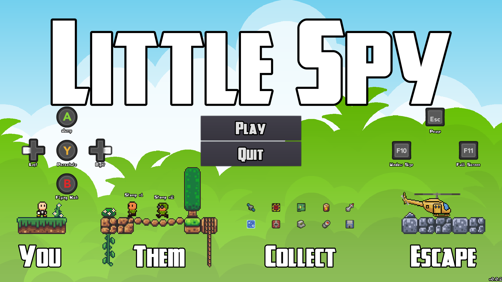
   
  Main Screen

  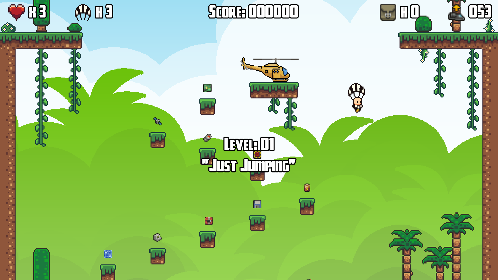
   
  Level 01 - "<i>Just Jumping</i>"

  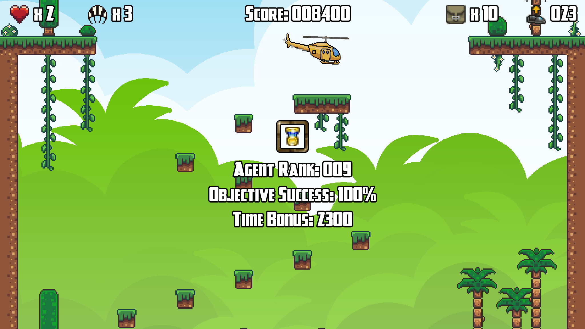
   
  Level 01 - Completed

